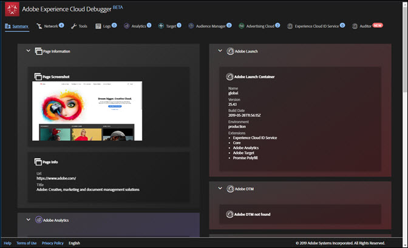

# 摘要畫面{#summary-screen}

若要執行 Experience Cloud Debugger，請按一下擴充功能列中的擴充功能圖示，然後在 Chrome 中開啟您要檢查的頁面。

Adobe Experience Cloud Debugger 摘要畫面隨即顯示。

此畫面會顯示頁面縮圖，以及 URL 和頁面標題。此畫面也會顯示各個 Adobe Experience Cloud 解決方案的相關資訊。顯示的資訊會依解決方案而異，但通常包括解決方案程式庫和版本 (例如「AppMeasurement 2.9 版」) 和帳戶 ID (例如 Analytics 報表套裝 ID、Target 用戶端代碼、Audience Manager 合作夥伴 ID 等) 的相關資訊。

視窗頂端的標籤旁邊的藍色數字會顯示已發出的伺服器呼叫數。您可以按一下個別標籤內的「**[!UICONTROL Clear All Requests]**」，將這些重設為零。

例如，下列影像顯示 Adobe Target 的相關資訊。請注意，您必須在程式碼或 Tag Manager 中實作 Debugging 事件監聽器，並在 Target UI 中開啟必要的[回應 Token](https://docs.adobe.com/content/help/en/target/using/administer/response-tokens.html)，才能顯示如下圖所示的活動詳細資料，而不需要進行驗證。

## 在 Auditor 中執行稽核 {#section-82bc57440406461ebf27a16855b71655}

您可以使用 Adobe Auditor 在頁面上執行一系列稽核。若要執行 ，請按一下頂端功能表中的「**[!UICONTROL Auditor]**」圖示，然後按一下「**[!UICONTROL Audit Page Now]**」。若要開啟 Adobe Auditor，請按一下「**[!UICONTROL Run Multi-Page Audit Now]**」。

## Debugger 中顯示的資訊 {#section-88a95ba53dca43d9b96a585e75e5f5cf}

以下是 Debugger 會針對各個解決方案顯示的資訊：

**頁面資訊**

<table id="table_FF3B9083524244D29AF350978A0AC236"> 
 <tbody> 
  <tr> 
   <td colname="col1"> 
頁面螢幕擷圖 
 </td> 
   <td colname="col2"> 
頁面縮圖 
 </td> 
  </tr> 
  <tr> 
   <td colname="col1"> 
URL 
 </td> 
   <td colname="col2"> 
頁面 URL 
 </td> 
  </tr> 
  <tr> 
   <td colname="col1"> 
標題 
 </td> 
   <td colname="col2"> 
&lt;TITLE&gt; 標籤中指定的名稱 
 </td> 
  </tr> 
 </tbody> 
</table>

**Adobe Analytics**

<table id="table_BEB9CC58E59D4D86BC895A8A51D84A2C"> 
 <tbody> 
  <tr> 
   <td colname="col1"> 
報表套裝 
 </td> 
   <td colname="col2"> 
<a href="https://docs.adobe.com/content/help/en/analytics/admin/manage-report-suites/report-suites-admin.html" format="html" scope="external">報表套裝</a>可全面而獨立地定義針對選定網站、一組網站或網頁子集的報告。 
 </td> 
  </tr> 
  <tr> 
   <td colname="col1"> 
版本 
 </td> 
   <td colname="col2"> 
針對頁面定義的 <a href="https://docs.adobe.com/content/help/en/analytics/implementation/js/overview.html" format="html" scope="external">AppMeasurement</a> 版本 
 </td> 
  </tr> 
  <tr> 
   <td colname="col1"> 
訪客版本 
 </td> 
   <td colname="col2"> 
<a href="https://docs.adobe.com/content/help/en/analytics/technotes/visitor-identification.html" format="html" scope="external">訪客 ID</a> 程式庫的版本。 
 </td> 
  </tr> 
  <tr> 
   <td colname="col1"> 
頁面名稱 
 </td> 
   <td colname="col2"> 
傳送至 Analytics 的 <a href="https://docs.adobe.com/content/help/en/analytics/implementation/vars/page-vars/page-variables.html" format="html" scope="external">pageName</a> 變數，包含網站的好記名稱。 
 </td> 
  </tr> 
  <tr> 
   <td colname="col1"> 
模組 
 </td> 
   <td colname="col2"> 
Adobe Analytics 載入的模組 
 </td> 
  </tr> 
 </tbody> 
</table>

**Audience Manager**

<table id="table_784AEABADBDA4D14BB9A7A9CB9EF07C3"> 
 <tbody> 
  <tr> 
   <td colname="col1"> 
合作夥伴 
 </td> 
   <td colname="col2"> 
DIL 例項的<a href="https://docs.adobe.com/content/help/en/audience-manager/user-guide/dil-api/dil-instance-methods.html#getpartner" format="html" scope="external">合作夥伴名稱</a> 
 </td> 
  </tr> 
  <tr> 
   <td colname="col1"> 
版本 
 </td> 
   <td colname="col2"> 
DIL 例項的<a href="https://docs.adobe.com/content/help/en/audience-manager/user-guide/api-and-sdk-code/rest-apis/aam-api-dil-methods.html#return-version-dil" format="html" scope="external">版本號碼</a> 
 </td> 
  </tr> 
  <tr> 
   <td colname="col1"> 
UUID 
 </td> 
   <td colname="col2"> 
與 DIL 例項相關聯的<a href="https://docs.adobe.com/content/help/en/audience-manager/user-guide/reference/ids-in-aam.html" format="html" scope="external">不重複的使用者 ID</a> 
 </td> 
  </tr> 
 </tbody> 
</table>

**Adobe Launch**

<table id="table_E9574975444A407887E26514D1BB1601"> 
 <tbody> 
  <tr> 
   <td colname="col1"> 
名稱 
 </td> 
   <td colname="col2"> 
Adobe Launch <a href="https://docs.adobe.com/content/help/en/launch/using/reference/admin/companies-and-properties.html" format="https" scope="external">屬性</a>名稱 
 </td> 
  </tr> 
  <tr> 
   <td colname="col1"> 
版本 
 </td> 
   <td colname="col2"> 
<a href="https://developer.adobelaunch.com/extensions/reference/turbine-free-variable/" format="https" scope="external">Turbine</a> 版本 
 </td> 
  </tr> 
  <tr> 
   <td colname="col1"> 
建置日期 
 </td> 
   <td colname="col2"> 
Launch<a href="https://docs.adobe.com/content/help/en/launch/using/reference/publish/libraries.html" format="https" scope="external"> 程式庫</a>建置日期 
 </td> 
  </tr> 
  <tr> 
   <td colname="col1"> 
環境 
 </td> 
   <td colname="col2"> 
Launch 程式庫使用的<a href="https://docs.adobe.com/content/help/en/launch/using/reference/publish/environments.html" format="https" scope="external">環境</a> 
 </td> 
  </tr> 
  <tr> 
   <td colname="col1"> 
指令碼目錄 
 </td> 
   <td colname="col2"> 
儲存 Launch 指令碼的所在目錄 
 </td> 
  </tr> 
 </tbody> 
</table>

**Adobe DTM**

<table id="table_DC76D63FA6EF4891906B9E1D3E4A8A6C"> 
 <tbody> 
  <tr> 
   <td colname="col1"> 
程式庫名稱 
 </td> 
   <td colname="col2"> 
Adobe DTM<a href="https://docs.adobe.com/content/help/en/dtm/using/library-management.html" format="html" scope="external"> 程式庫</a>名稱 
 </td> 
  </tr> 
  <tr> 
   <td colname="col1"> 
版本 
 </td> 
   <td colname="col2"> 
Turbine 版本 
 </td> 
  </tr> 
  <tr> 
   <td colname="col1"> 
建置日期 
 </td> 
   <td colname="col2"> 
Launch<a href="https://docs.adobe.com/content/help/en/dtm/using/library-management.html" format="html" scope="external"> 程式庫</a>建置日期 
 </td> 
  </tr> 
  <tr> 
   <td colname="col1"> 
環境 
 </td> 
   <td colname="col2"> 
DTM 程式庫使用的環境 
 </td> 
  </tr> 
  <tr> 
   <td colname="col1"> 
指令碼目錄 
 </td> 
   <td colname="col2"> 
儲存 DTM 指令碼的所在目錄 
 </td> 
  </tr> 
 </tbody> 
</table>

**Adobe Experience Cloud ID 服務**

<table id="table_274CFCEFA8F34D16BB546B4669EC0209"> 
 <tbody> 
  <tr> 
   <td colname="col1"> 
Experience Cloud 組織 ID 
 </td> 
   <td colname="col2"> 
您的<a href="https://docs.adobe.com/content/help/en/id-service/using/home.html" format="https" scope="external">組織 ID</a> 
 </td> 
  </tr> 
  <tr> 
   <td colname="col1"> 
版本 
 </td> 
   <td colname="col2"> 
<a href="https://docs.adobe.com/content/help/en/analytics/technotes/visitor-identification.html" format="html" scope="external">訪客 ID</a> 程式庫版本 
 </td> 
  </tr> 
 </tbody> 
</table>

**Adobe Target**

<table id="table_D30E0CD20FB04E41862B22655136E043"> 
 <tbody> 
  <tr> 
   <td colname="col1"> 
用戶端代碼 
 </td> 
   <td colname="col2"> 
您的 Target <a href="https://docs.adobe.com/content/help/en/target/using/implement-target/client-side/deploy-at-js/implementing-target-without-a-tag-manager.html" format="html" scope="external">用戶端代碼</a> 
 </td> 
  </tr> 
  <tr> 
   <td colname="col1"> 
版本 
 </td> 
   <td colname="col2"> 
您目前的 <a href="https://docs.adobe.com/content/help/en/target/using/implement-target/client-side/target-atjs-versions.html" format="html" scope="external">at.js</a> 或 mbox.js 版本 
 </td> 
  </tr> 
  <tr> 
   <td colname="col1"> 
全域 mbox 名稱 
 </td> 
   <td colname="col2"> 
<a href="https://docs.adobe.com/help/en/target/using/implement-target/client-side/mbox-implement/global-mbox/understanding-global-mbox.html" format="html" scope="external">全域 mbox</a>是指 Target 實作中各網頁頂端所發出的單一伺服器呼叫 
 </td> 
  </tr> 
  <tr> 
   <td colname="col1"> 
Mbox 名稱 
 </td> 
   <td colname="col2"> 
頁面上某個<a href="https://docs.adobe.com/content/help/en/target/using/implement-target/client-side/mbox-implement/global-mbox/understanding-global-mbox.html" format="html" scope="external">位置</a>周圍的 mbox 名稱。只有當您在程式碼或 Tag Manager 中實作 Debugging 事件監聽器，並在 Target UI 中開啟必要的<a href="https://docs.adobe.com/content/help/en/target/using/administer/response-tokens.html" format="html" scope="external">回應 Token</a> 時，才能無須驗證即可取得。 
 </td> 
  </tr> 
  <tr> 
   <td colname="col1"> 
活動名稱 
 </td> 
   <td colname="col2"> 
Target <a href="https://docs.adobe.com/content/help/en/target/using/activities/activities.html" format="html" scope="external">促銷活動或活動</a>的名稱。只有當您在程式碼或 Tag Manager 中實作 Debugging 事件監聽器，並在 Target UI 中開啟必要的<a href="https://docs.adobe.com/content/help/en/target/using/administer/response-tokens.html" format="html" scope="external">回應 Token</a> 時，才能無須驗證即可取得。 
 </td> 
  </tr> 
  <tr> 
   <td colname="col1"> 
活動 ID 
 </td> 
   <td colname="col2"> 
Target 活動 ID。只有當您在程式碼或 Tag Manager 中實作 Debugging 事件監聽器，並在 Target UI 中開啟必要的<a href="https://docs.adobe.com/content/help/en/target/using/administer/response-tokens.html" format="html" scope="external">回應 Token</a> 時，才能無須驗證即可取得。 
 </td> 
  </tr> 
  <tr> 
   <td colname="col1"> 
指導方針名稱 
 </td> 
   <td colname="col2"> 
Target <a href="https://docs.adobe.com/content/help/en/target/using/experiences/experiences.html" format="html" scope="external">體驗</a>的名稱。只有當您在程式碼或 Tag Manager 中實作 Debugging 事件監聽器，並在 Target UI 中開啟必要的<a href="https://docs.adobe.com/content/help/en/target/using/administer/response-tokens.html" format="html" scope="external">回應 Token</a> 時，才能無須驗證即可取得。 
 </td> 
  </tr> 
  <tr> 
   <td colname="col1"> 
指導方針 ID 
 </td> 
   <td colname="col2"> 
Target 指導方針 ID。只有當您在程式碼或 Tag Manager 中實作 Debugging 事件監聽器，並在 Target UI 中開啟必要的<a href="https://docs.adobe.com/content/help/en/target/using/administer/response-tokens.html" format="html" scope="external">回應 Token</a> 時，才能無須驗證即可取得。 
 </td> 
  </tr> 
  <tr> 
   <td colname="col1"> 
選件 
 </td> 
   <td colname="col2"> 
Target <a href="https://docs.adobe.com/content/help/en/target/using/experiences/offers/manage-content.html" format="html" scope="external">選件</a>的名稱。只有當您在程式碼或 Tag Manager 中實作 Debugging 事件監聽器，並在 Target UI 中開啟必要的<a href="https://docs.adobe.com/content/help/en/target/using/administer/response-tokens.html" format="html" scope="external">回應 Token</a> 時，才能無須驗證即可取得。 
 </td> 
  </tr> 
  <tr> 
   <td colname="col1"> 
選件 ID 
 </td> 
   <td colname="col2"> 
Target 選件 ID。只有當您在程式碼或 Tag Manager 中實作 Debugging 事件監聽器，並在 Target UI 中開啟必要的<a href="https://docs.adobe.com/content/help/en/target/using/administer/response-tokens.html" format="html" scope="external">回應 Token</a> 時，才能無須驗證即可取得。 
 </td> 
  </tr> 
 </tbody> 
</table>

